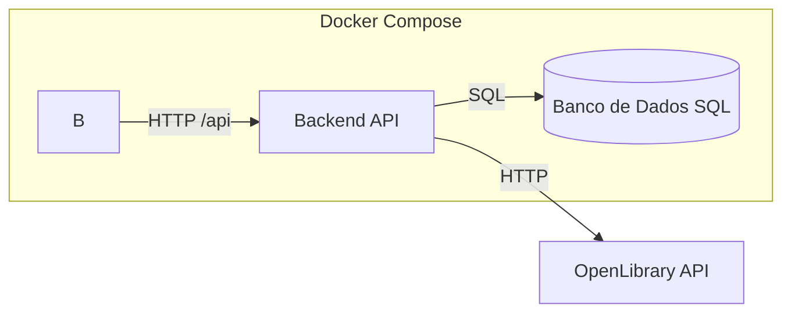

## Gerenciador de Livros Lidos (OpenLibrary)

API Flask que pesquisa livros na OpenLibrary, cacheia resultados em SQLite para uso offline e permite marcar obras como lidas com uma observação opcional. A documentação interativa está disponível em `/swagger`.

## Visão geral
- Busca paginada na OpenLibrary com filtros por autor, título ou texto livre.
- Cache local em SQLite para minimizar chamadas externas e permitir paginação offline.
- Registro de leitura com nota opcional e consulta paginada dos livros lidos.
- API documentada via Swagger e pronta para execução local ou via Docker/Docker Compose.

## Arquitetura (fluxograma)


## Requisitos
- Python 3.11+ e `pip`
- Docker e Docker Compose (opcional, para containerizar)
- Acesso à internet para consultar a OpenLibrary (não é necessária chave de API)

## Instalação e execução local
1. Clone o repositório e, opcionalmente, crie um ambiente virtual:
   ```bash
   python -m venv .venv
   source .venv/bin/activate
   ```
2. Instale as dependências:
   ```bash
   pip install -r requirements.txt
   ```
3. (Opcional) Defina variáveis de ambiente, se quiser alterar os padrões:
   ```bash
   export DATABASE_URL=sqlite:////app/instance/books.db  # caminho do SQLite
   export PORT=5000                                      # porta do Flask/Gunicorn
   ```
4. Inicie a API:
   ```bash
   python run.py
   ```
5. Acesse a documentação: `http://localhost:5000/swagger`.

## Execução com Docker ou Docker Compose
- Docker simples:
  ```bash
  docker build -t books-api .
  docker run -p 5000:5000 \
    -e PORT=5000 \
    -e DATABASE_URL=sqlite:////app/instance/books.db \
    -v $(pwd)/instance:/app/instance \
    books-api
  ```
- Docker Compose:
  ```bash
  docker compose up -d
  ```
  O volume `./instance` é montado para persistir o SQLite fora do container.

## Variáveis de ambiente principais
- `DATABASE_URL` (default `sqlite:////app/instance/books.db`): string de conexão do banco.
- `PORT` (default `5000`): porta de exposição da API.
- `GUNICORN_WORKERS` (default `3`), `GUNICORN_THREADS` (default `2`), `GUNICORN_TIMEOUT` (default `120`): ajuste de processo/threads quando em modo Gunicorn (Docker/produção).

## Endpoints principais
- `GET /books`: busca paginada na OpenLibrary. Query params: `page`, `limit` (até 50), `author`, `title`, `q`.
- `GET /reads`: lista paginada dos livros marcados como lidos localmente. Query params: `page`, `per_page` (até 50).
- `POST /reads`: body `{"external_id": "<key da OpenLibrary>", "note": "observação opcional"}` para marcar como lido e salvar nota.
- Swagger: `/swagger`.

## Estrutura resumida
- `app/controllers`: rotas RESTX.
- `app/services`: regras de negócio (busca, cache, marcação de leitura).
- `app/clients`: cliente HTTP da OpenLibrary.
- `app/repositories`: persistência em SQLite (cache e livros lidos).
- `app/models`: modelos SQLAlchemy.
- `scripts/migrate_db.py`: utilitário para migração/garantia do schema.

## Persistência e cache
- Banco padrão em `instance/books.db` (criado automaticamente).
- Tabelas `book_cache` (cache da OpenLibrary) e `read_books` (leituras com nota).
- Monte o volume `./instance` em produção para não perder dados ao recriar containers.
